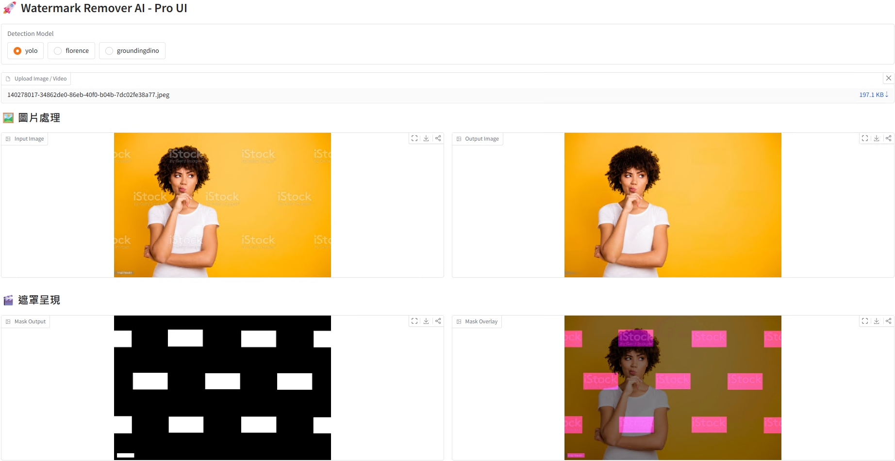
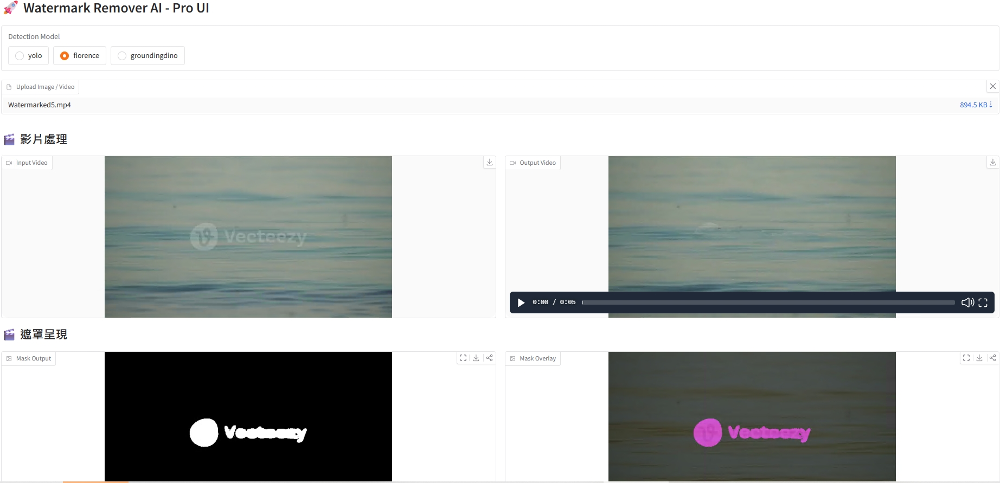

<p align="center">
  English | <a href="README.zh-TW.md">中文</a>
</p>

<p align="center">
  
  
  
  
  
</p>

<p align="center">
 
  
  
</p>

# Watermark Remover AI Pro - Professional Multi-Model AI Watermark Removal Tool with Tiling and Rotation Detection

An AI-powered tool for automatically detecting and identifying watermarks in images and videos and removing them. This project supports **YOLO**, **Florence-2**, and **GroundingDino** for watermark detection, can pair with **SAM2** for refined mask areas, and provides tiling scanning and rotation detection features. After detection boxes generate mask files, the **LaMa** model performs high-quality image inpainting. All detection and removal parameters can be manually adjusted.

---

## ✨ Key Features

- **Multi-media Support**: Supports images (`.png`, `.jpg`, etc.) and videos (`.mp4`, `.mov`, etc.) files.

- **Three Watermark Detection Models**:
  - **YOLO Model**: Fast speed, suitable for detecting fixed-style watermarks.
  - **Florence-2 Model**: Highly flexible, guides AI to locate watermarks through LLM Prompt conversation.
  - **GroundingDino Model**: Focused on detection + grounding, guides AI to locate watermarks through text instructions.
  - **SAM2 Model**: Outlines and refines the shape of the mask instead of its rectangle box.

- **High-Quality Inpainting**: Uses the **LaMa** model for image inpainting, delivering natural results with minimal traces.

- **Dual Operation Interfaces**:
  - **WebUI**: Provides a simple and easy-to-use Web graphical interface with detailed parameter explanations for most users.
  - **Command Line**: Provides a full-featured CLI via `main.py`, convenient for integration and automation.

- **Performance Optimization**:
  - **Batch Processing**: Batch processing for both detection and inpainting stages, significantly improving video processing speed.
  - **GPU Acceleration**: Full NVIDIA GPU (CUDA) support, with NVENC hardware acceleration for video encoding.
  - **Half-Precision Inference**: Supports FP16 half-precision, reducing VRAM usage and improving speed on compatible GPUs.

- **Enhanced Detection Mechanisms**:
  - **Tiling & Rotation Detection**: Introduces multi-area segmentation viewing and rotated detection boxes to handle randomly distributed and tilted watermarks.

---

## 🚀 Installation & Setup

### 1. Requirements

- Python 3.12+
- `pip` (Python package manager)
- **FFmpeg**: Essential tool for video audio processing. Ensure it's installed and added to your system PATH. Download from [**FFMpeg**](https://www.ffmpeg.org/download.html).
- **NVIDIA GPU (Recommended)**: For ideal processing speed, an NVIDIA graphics card is strongly recommended, with corresponding [**CUDA Toolkit**](https://developer.nvidia.com/cuda-toolkit) and [**drivers**](https://www.nvidia.com/drivers/) installed.

---

### 2. Installation Steps

1. **Clone the GitHub Repository** (if not already downloaded):

   ```bash
   git clone https://github.com/OhMy-Git/WatermarkRemover-AI-Pro.git WatermarkRemover-AI-Pro
   cd WatermarkRemover-AI-Pro
   ```

2. **Install Python Dependencies**:
   The `requirements.txt` file is ready. Run the following command to install all necessary libraries:

   ```bash
   pip install -r requirements.txt
   ```

3. **Install GroundingDino**:

   ```bash
   cd src/grdoundingdino
   pip install ".[dev]"
   ```

   Or

   ```bash
   cd src/grdoundingdino
   pip install --no-build-isolation -e .
   ```

4. **Download Model and Weight Files**:
   This project requires the following model files. Please download and place them in the correct directories:
   - **YOLO Model** (for detection):
     - Download the watermark-related model from [here](https://huggingface.co/corzent/yolo11x_watermark_detection/blob/main/best.pt) and rename it to `yolo.pt`.
     - Or place your own trained YOLO model file (named `yolo.pt`) in the `models/` directory.
     - Final path: `models/yolo.pt`

   - **LaMa Model** (for inpainting):
     - Download the `big-lama.pt` file from [here](https://huggingface.co/fashn-ai/LaMa/resolve/main/big-lama.pt).
     - Place the downloaded file in the `models/` directory.
     - Final path: `models/big-lama.pt`

   - **Florence-2 Model**
     - Will be automatically downloaded by the `transformers` library on first use. Please ensure you have an internet connection.

   - **GroundingDino and SAM2 Weights and Config Files**
     - Please download and place them in the weights directory with the correct names as shown in the project structure.
     - Download the `groundingdino` files from [here](https://huggingface.co/pengxian/grounding-dino/tree/main).
     - Download the `sam2_hiera_large.pt` and `sam2_hiera_l.yaml` files from [here](https://huggingface.co/facebook/sam2-hiera-large/tree/main).

---

## 📁 Project Structure

```
WatermarkRemover-AI/
├── main.py                    # Main program, CLI entry point
├── webui.py                   # WebUI interface
├── check_env.py               # Environment configuration checker
├── requirements.txt           # Python dependencies
├── src/groundingdino          # GroundingDino setup
├── models/                    # Model files directory
│   ├── yolo.pt                # YOLO detection model (manual download)
│   └── big-lama.pt            # LaMa inpainting model (manual download)
├── weights/                   # Model weights directory
│   ├── groundingdino_swinb_cfg.py
│   ├── groundingdino_swinb_cogcoor.pth
│   ├── sam2_hiera_b+.yaml
│   ├── sam2_hiera_l.yaml
│   └── sam2_hiera_large.pt
└── output_webui/              # WebUI output directory

```

---

## 🕹️ Usage

You can use this tool in two different ways:

### 1. WebUI (Recommended)

This is the simplest and most intuitive way to use the tool. Run from the project root directory:

```bash
python webui.py
```

The program will start a local web service (usually at `http://127.0.0.1:7860`). Open this address in your browser to see the interface. All parameters are explained on the UI.

### 2. Command Line (`main.py`)

For advanced users or batch automation scenarios.

**Basic usage:**

```bash
python main.py --input <input_file_or_directory> --output <output_directory> [options]
```

### 3. Main CLI Parameters:

| Parameter                     | Default  | Description                                                             |
| ----------------------------- | :------- | :---------------------------------------------------------------------- |
| `--resize-limit`              | `768`    | Maximum image size before inpainting.                                   |
| `--BBox Expand Pixels`        | `0`      | Pixel expansion for detection boxes.                                    |
| `--Max BBox Area (%)`         | `10`     | Maximum percentage of watermark detection box area to total image area. |
| `--lama-scale`                | `1`      | Resolution scale factor for LaMa inpainting.                            |
| `--Rotation Step (°)`         | `0`      | Rotation step angle for detecting tilted watermarks.                    |
| `--tiles-per-axis`            | `3`      | Number of grid divisions per side for tiling detection. Total = square. |
| `--Tile Overlap`              | `0.25`   | Overlap ratio between tiles in tiling detection.                        |
| `--Use FP16`                  | Enabled  | Enable FP16 half-precision inference.                                   |
| `--Use SAM-2 Mask Refine`     | Disabled | Use SAM2 for refined mask outlines.                                     |
| `--CLAHE Mode`                | off      | Enhance image contrast to highlight watermarks for detection.           |
| `--video-batch-size`          | `8`      | Batch size for video processing, affects speed and VRAM usage.          |
| `--use-first-frame-detection` | Disabled | Enable first-frame detection mode for videos.                           |

**YOLO-Specific Parameters:**

| Parameter            | Default | Description                               |
| -------------------- | :------ | :---------------------------------------- |
| `--conf-threshold`   | `0.6`   | YOLO detection confidence threshold.      |
| `--iou-threshold`    | `0.45`  | YOLO IOU threshold.                       |
| `--Single Detection` | Enabled | Use fast detection mode.                  |
| `--Yolo Image Size`  | `640`   | Image size used for YOLO model inference. |

---

### Examples

### Image + YOLO Example



### Video + Florence-2 + SAM2 Example



---

## ⚡ Performance Tips

- **Use GPU**: This is the most important performance factor. Ensure your environment has CUDA configured correctly. Otherwise, it will run on CPU which is slow.
- **First-Frame Detection**: For videos with fixed watermark positions, be sure to check "Use First Frame Mask for Videos" in WebUI, or use `--use-first-frame-detection` in CLI. This is the **most effective** video processing acceleration.
- **Adjust Batch Size (Video Batch Size)**: Appropriately increase this parameter based on your GPU VRAM to improve GPU utilization and speed up video processing. If you encounter Out of Memory errors, decrease this value.
- **Adjust YOLO Image Size (YOLO Image Size)**: Reducing this value (e.g., from 1280 to 640) can significantly speed up YOLO detection, but may sacrifice detection accuracy for small watermarks. Adjust according to your actual needs.

---

## 🛠 Development Tools

- Python 3.12 syntax
- PEP 8 coding style
- Loguru for logging
- Click for CLI argument parsing
- PyTorch for deep learning model inference

---

## 🧠 Technical Guidelines

- Deep Learning Framework: PyTorch
- Computer Vision: OpenCV
- Web Framework: Gradio (WebUI)
- Model Libraries:
  - ultralytics (YOLO) v11 for watermark
  - transformers (Florence-2)
  - LaMa (mask-based inpainting)
- Utilities: numpy, PIL, tqdm, loguru

---

## ❓ FAQ

1. **Missing model files**: Ensure model files are downloaded and placed in the `models` folder with correct filenames.
2. **CUDA unavailable**: Check NVIDIA driver and CUDA Toolkit installation: verify `torch.cuda.is_available()`
3. **FFmpeg errors**: Ensure FFmpeg is installed and added to system PATH. Verify it can be called from the OS: `FFmpeg`
4. **Insufficient VRAM (GPU memory)**: Reduce batch processing size or disable half-precision inference.

---

## 💡 Recommendations

1. If the output still has incomplete watermark removal, you can use manual post-processing tools such as **Lama Cleaner** or **IOPaint** for fine manual processing.
2. For videos with fixed watermark positions, you can extract the first frame as an image file, adjust parameters and run in image mode first, check if the output mask detection position is correct, then apply the correct parameters to video mode.
3. Keep an eye on Yolo model progress and use suitable versions.

This project is inspired by https://comfyui.org/en/ai-powered-watermark-removal-workflow
